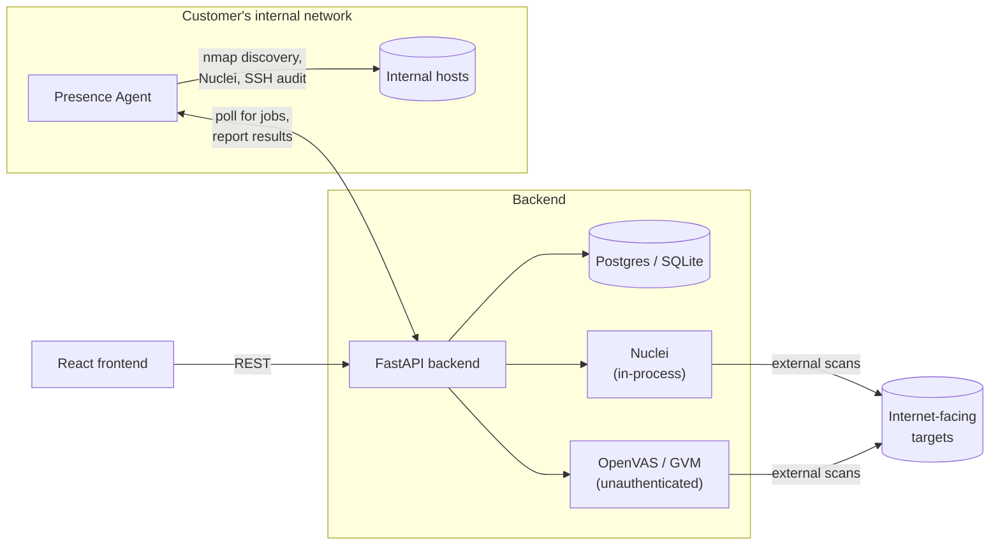
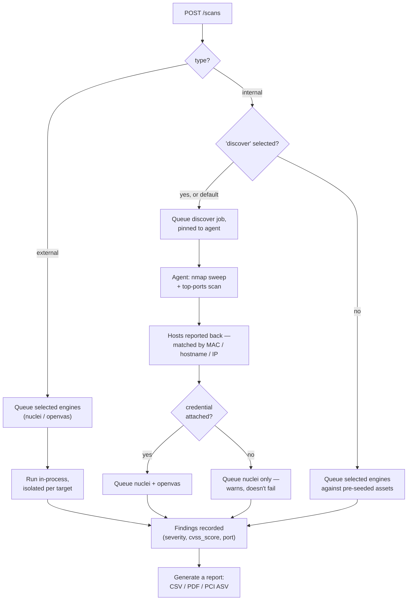

# Scanner Backend

FastAPI backend for vendors to scan internal and external assets for vulnerabilities.
A scan runs whichever engines are selected (Discovery, Nuclei, OpenVAS/SSH-Audit) as
independent per-engine records, each isolated per-target — one bad target or a slow
engine never blocks or invalidates the others.

This repo also has a React frontend (`frontend/`) and a separate on-site "Presence
Agent" (`agent/`) for scanning a customer's internal network; both have their own
READMEs. The backend's JSON API can also be exercised directly with curl/Postman.

## Architecture



The presence agent never accepts inbound connections — it's the one thing that
initiates contact, long-polling the backend for work over plain outbound REST. This is
also why credentialed checks (the SSH audit) only apply to internal scans; external
scans through Nuclei/OpenVAS are always unauthenticated, since that's what an ASV scan
is supposed to represent (see PCI DSS 11.3.2 vs 11.3.1).

### Scan lifecycle



A retry only re-attempts targets that didn't already succeed (tracked per
engine-per-target), whether the scan is internal or external.

## Setup

### Option A — Docker Compose (recommended)

Everything (backend + Nuclei + OpenVAS/GVM + Postgres) runs in containers. Nuclei is
baked into the backend image at a pinned version, so it can never depend on — or be
broken by — whatever happens to be on the host's `PATH`.

```bash
docker compose up -d --build
```

- Schema migrations (Alembic, see `migrations/`) run automatically on every container
  start, before the app boots — nothing to do here even after pulling schema changes.
- API: http://localhost:8088 (Swagger UI: http://localhost:8088/docs)
- First boot only: the `openvas` container restores its base vulnerability database —
  this is CPU-heavy and can take **10–20 minutes**. Watch it with:
  ```bash
  docker compose logs -f openvas
  ```
  Until that finishes, OpenVAS-side scans will fail fast with a clear "socket missing"
  error — Nuclei is unaffected and completes normally in the meantime. Data persists in
  a named volume, so this delay only happens once.
- Port 8088 was chosen because 8000/8080 are commonly already in use — change the
  `backend.ports` mapping in `docker-compose.yml` if 8088 conflicts on your machine too.

### Option B — Local with uv (lighter, no OpenVAS in-container)

```bash
uv sync
cp .env.example .env   # defaults to a local SQLite file, no external services required
uv run alembic upgrade head   # creates/updates the schema — rerun after pulling any migration changes
uv run uvicorn app.main:app --reload
```

Requires `nuclei` installed and on `PATH` yourself, and a real `gvmd` reachable at
`OPENVAS_SOCKET_PATH` for OpenVAS to work (otherwise it fails gracefully, Nuclei still
runs). Use this for quick local iteration on the API; use Option A for anything you want
to trust end-to-end.

Swagger UI: http://127.0.0.1:8000/docs

## Workflow

1. Add assets (`hostname` and/or `ip_address`).
2. Create a scan against one or more assets, `type` = `internal` or `external`.
3. Poll `/api/v1/scans/{id}/status` for live per-engine progress.
4. Fetch `/api/v1/scans/{id}/findings` for results, separated by engine.
5. Download a report (`/api/v1/reports/csv` or `/pdf`).

## Example curl session

Base URL below is `http://localhost:8088` (Docker Compose setup) — use `http://127.0.0.1:8000`
instead if you're running Option B.

> **Windows / PowerShell users:** `curl` is aliased to `Invoke-WebRequest`, which does not
> understand these flags. Either call `curl.exe` explicitly (real curl, ships with Windows
> 10/11) instead of `curl`, or use `Invoke-RestMethod`. Every command below is kept to a
> single line for exactly this reason — PowerShell doesn't support bash's `\` line
> continuation (it uses backtick `` ` `` instead), so multi-line curl commands copied from
> bash-oriented docs will fail to parse there.

```bash
# Create an asset
curl.exe -s -X POST http://localhost:8088/api/v1/assets -H "Content-Type: application/json" -d '{"hostname": "example.com", "environment": "production", "criticality": "high"}'

# List assets
curl.exe -s http://localhost:8088/api/v1/assets

# Start a scan (asset_ids from the response above) — runs the default engine set
curl.exe -s -X POST http://localhost:8088/api/v1/scans -H "Content-Type: application/json" -d '{"type": "external", "asset_ids": [1]}'

# Poll per-engine status
curl.exe -s http://localhost:8088/api/v1/scans/1/status

# Findings, separated by engine (never merged)
curl.exe -s http://localhost:8088/api/v1/scans/1/findings

# Cancel a running scan
curl.exe -s -X POST http://localhost:8088/api/v1/scans/1/cancel

# All findings across scans, optionally filtered
curl.exe -s "http://localhost:8088/api/v1/findings?severity=Critical&engine=nuclei"

# CSV / PDF report (optionally scoped to one scan)
curl.exe -s "http://localhost:8088/api/v1/reports/csv?scan_id=1" -o report.csv
curl.exe -s "http://localhost:8088/api/v1/reports/pdf?scan_id=1" -o report.pdf

# Agent presence heartbeat
curl.exe -s -X POST http://localhost:8088/api/v1/agents/heartbeat -H "Content-Type: application/json" -d '{"name": "internal-agent-1", "type": "internal"}'
```

Native PowerShell equivalent for any of the POST calls (no `curl.exe` needed):

```powershell
Invoke-RestMethod -Method Post -Uri http://localhost:8088/api/v1/scans -ContentType "application/json" -Body '{"type": "external", "asset_ids": [1]}'
```

## Endpoints

| Method | Path                             | Description                                   |
|--------|----------------------------------|------------------------------------------------|
| POST   | `/api/v1/assets`                 | Create an asset                                |
| GET    | `/api/v1/assets`                 | List assets                                    |
| GET    | `/api/v1/assets/{id}`            | Get one asset                                  |
| DELETE | `/api/v1/assets/{id}`            | Delete an asset                                |
| POST   | `/api/v1/scans`                  | Create a scan; optional `engines` list picks which to run |
| GET    | `/api/v1/scans`                  | List scans (with per-engine sub-records)       |
| GET    | `/api/v1/scans/{id}`             | Get one scan                                   |
| GET    | `/api/v1/scans/{id}/status`      | Live per-engine status/progress                |
| GET    | `/api/v1/scans/{id}/findings`    | Findings, separated by engine                  |
| POST   | `/api/v1/scans/{id}/cancel`      | Cooperatively cancel a running scan            |
| POST   | `/api/v1/scans/{id}/retry`       | Retry failed engines/targets only              |
| GET    | `/api/v1/findings`               | All findings (filter: scan_id, asset_id, engine, severity) |
| GET    | `/api/v1/reports/csv`            | Always-live CSV report (optional `scan_id`)    |
| GET    | `/api/v1/reports/pdf`            | Always-live PDF report (optional `scan_id`)    |
| POST   | `/api/v1/reports`                | Generate and persist a report snapshot (`format`: csv/pdf/pci) |
| GET    | `/api/v1/reports`                | List persisted reports (optional `scan_id`)    |
| GET    | `/api/v1/reports/{id}/download`  | Download a persisted report                    |
| DELETE | `/api/v1/reports/{id}`           | Delete a persisted report                      |
| POST   | `/api/v1/agents/heartbeat`       | Register/refresh agent presence                |
| GET    | `/api/v1/agents`                 | List agents                                    |
